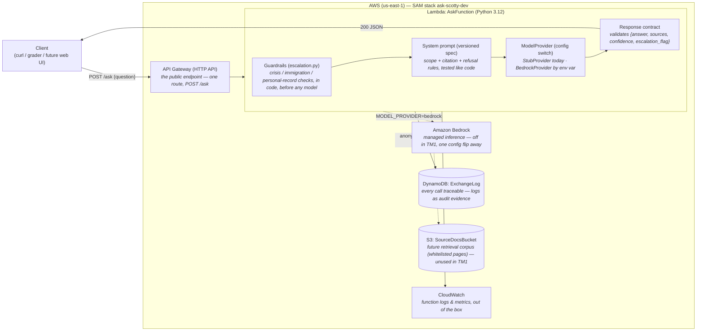

# Architecture Diagram — Ask Scotty (TM1 baseline)

## Components, one line each

| Component | One-line description |
|---|---|
| **API Gateway (HTTP API)** | The single public entry point; exposes exactly one contract-first route, `POST /ask`. |
| **AskFunction (Lambda)** | The whole service: receive → guardrails → build prompt → call model → validate → log → return. |
| **Guardrails (`escalation.py`)** | Scope exclusions enforced by structure, not accuracy targets — crisis, immigration, and personal-record questions never reach a model. |
| **System prompt (`system_prompt.md`)** | The behavioral spec — versioned, tested, and reviewed like code. |
| **ModelProvider (`providers/`)** | One interface, swappable by config: stub today, Bedrock when the team flips `MODEL_PROVIDER`. |
| **Response contract (`contract.py`)** | Every answer is validated structured data: `{answer, sources, confidence, escalation_flag}`. |
| **DynamoDB ExchangeLog** | Anonymized log of every exchange with a 90-day TTL — the pilot's measurement instrument and audit trail. |
| **S3 SourceDocsBucket** | Reserved seam for the retrieval (RAG) corpus of whitelisted pages — deliberately empty in TM1. |
| **CloudWatch** | Logs and metrics for the function — observability out of the box. |

## Mapping to the course "Anatomy of an AI Application" (Week 3, Fig. 03)

| Fig. 03 box | Where it lives here |
|---|---|
| Request | API Gateway `POST /ask` |
| Context — system prompt | `prompts/system_prompt.md` (versioned spec) |
| Context — retrieval (RAG) | S3 bucket seam, deferred |
| Context — tools | none yet, deliberately (read-only pilot) |
| Model | ModelProvider (stub / Bedrock) |
| Response — checked structure | `contract.py` validation |
| State & sessions | none — single-turn by design in TM1 |
| Access & identity | LabRole (service), open endpoint in dev |
| Logging & observability | DynamoDB exchange log + CloudWatch |
